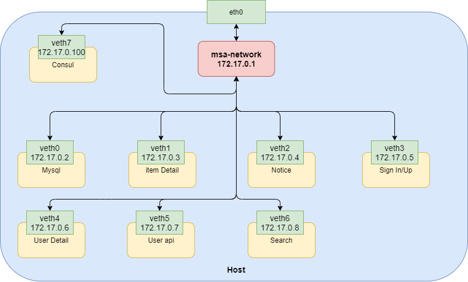

# MSA로 구현한 중고거래 사이트

## 👊 프로젝트 목표

그동안의 교육 커리큘럼(AWS, Docker, K8s, kafka, ansible ..)을 활용해 직접 프로젝트를 해본다는 것에 집중한다. 서비스의 구성요소는 기존의 당근마켓과 유사하게 구현하되, 검색 서비스에 강점을 두어 차별성 있는 Clone Project로 개발해보려한다.

## 🙋 프로젝트 구성원

- 강인솔 rkddlsthf123@gmail.com
- 박신형 orpsh1941@gmail.com
- 유민지 youminji62@gmail.com
- 정재우 jaewoo.jeongg@gmail.com

## 📚 요구사항 분석

## 🗨️ Use Case Diagram

## 💻 Function

1. 로그인/회원가입
2. 거래
3. 댓글
4. 검색엔진(Elasticsearch), 인기 검색어/추천 서비스(ELK)

## 🖥️ Tech Stack

1. Django Framework: 개발 기간이 짧아 바로 개발에 들어갈 수 있는 Django를 선택했다. 하지만 중량 프레임워크인 Django는 API 생성 및 통신 측면에서 사용하기 까다로웠다. 개선점으로서 Flaks 사용, 또는 Spring Framework를 사용해 MSA를 구현하고 Spring Cloud를 추가해보는 것도 좋을 것 같다.
2. Kafka: 용도에 따라 데이터베이스를 분리하고 데이터베이스간 동기화를 위해 Kafka를 사용했다. 현재 프로젝트에서는 매물 조회가 빈번하게 발생할 것을 예상, 조회DB와 등록, 수정, 삭제 용도의 DB를 나누어 오버헤드를 줄였고 분리된 DB 동기화를 위해 MQ로서 Kafka를 사용했다. MQ에는 대표적으로 Kafka와 RabbitMQ, ActivaMQ가 있으나 교육을 통해 배운 것은 Kafka이고 그동안의 커리큘럼을 활용해 직접 프로젝트를 해본다는 것에 집중하기 위해 Kafka를 선택했다.
3. ELK(ElasticSearch + Logstash + Kibana): 로그 수집 플랫폼으로 `ELK스택`이 많이 알려져있다. 프로젝트에서는 사용자의 검색 패턴 분석을 위해 ELK 사용을 계획했다.
4. Consul: Service Discovery로 `Consul`을 사용했다. 서비스들의 정보(IP, PORT)를 정의해두고 각 서비스들이 Consul에 정보를 요청해서 통신하도록 구성했다. 
5. Docker: 로컬환경에서 Bridge-Network를 구성해 각 서비스들을 네트워크 내에서 통신할 수 있도록 구성했다. 

## 🐬 Docker Network

- 프로젝트에서 구현한 Docker Network 구조
- physical network interface인 eth0에 msa-network라는 bridge 생성
- `msa-network`라는 bridge는 virtual network interface인 veth0~veth7와 `172.17.0.0/24`로 같은 네트워크에 묶음
- msa-network `172.17.0.0.1`은 veth0~veth7의 <u>default gateway</u> 역할을 한다.

- k8s Pod로 컨테이너를 관리하기위해 docker-network 구조는 중요하다고 생각해서 정리했다.

## ⚙️ 시스템 구성도

## 📘 DB설계

#### User Table

#### Item Table

#### Sold_Item Table

#### Comment Table

#### ERD

